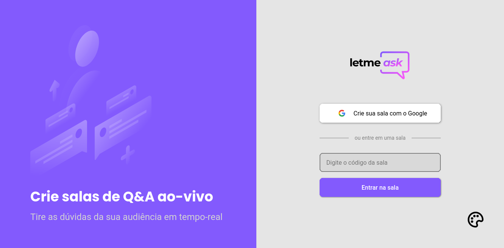
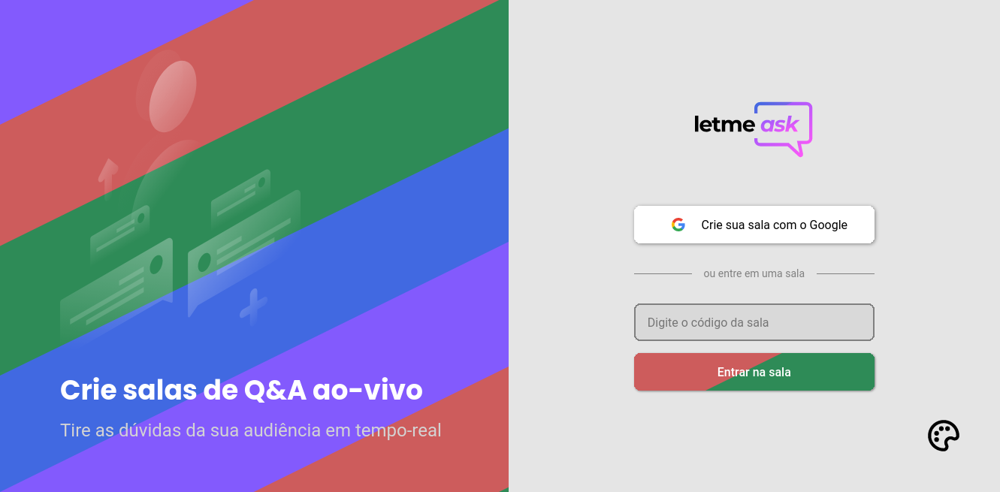
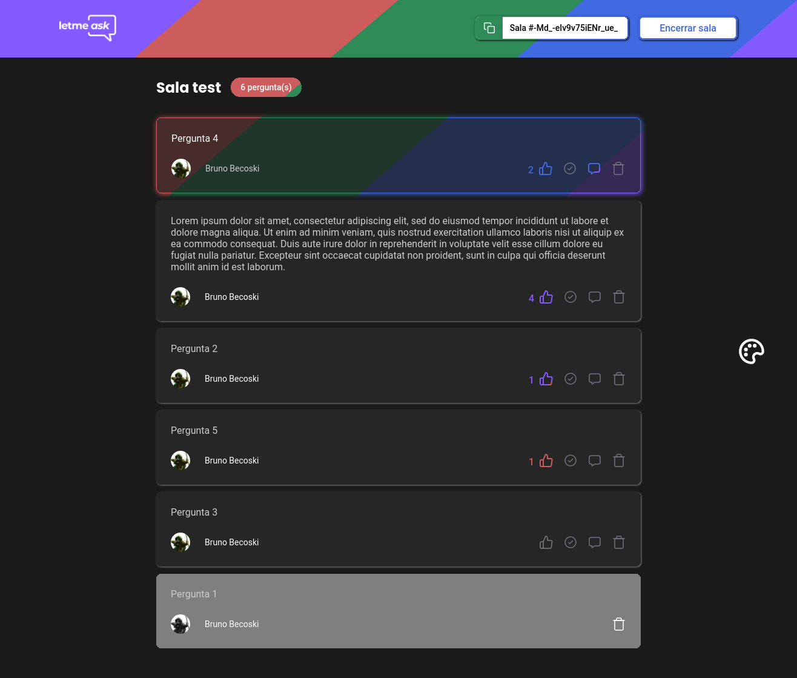

  

 

  <a href="#-sobre">Sobre</a>&nbsp;&nbsp;&nbsp;|&nbsp;&nbsp;&nbsp;
  <a href="#-layout">Layout</a>&nbsp;&nbsp;&nbsp;|&nbsp;&nbsp;&nbsp;
  <a href="#-tecnologias">Tecnologias</a>

 

 

  

 

## 📖 Sobre
O LetMeAsk é um app para responder perguntas em lives desenvolvido durante a NLW#5 da Rocketseat Trilha ReactJs entre os dias 20 e 27 de Junho 2021. 

 

## 🖼 Layout

   
   

 

## ⚙ Tecnologias

Esse projeto foi desenvolvido com as seguintes tecnologias:

- [ReactJS](https://www.reactjs.org)
- [TypeScript](https://www.typescriptlang.org)
- [StyledComponent](https://styled-components.com)
- [Firebase](https://firebase.google.com)
  * Authentication
  * Realtime Database
